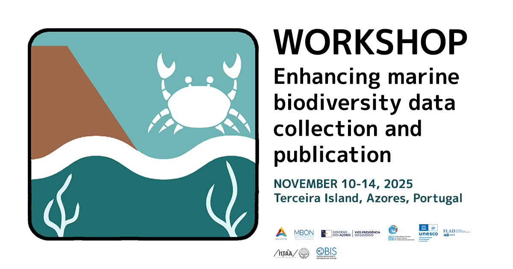

 See instructions in the comments below for how to edit specific sections of this workshop template. 


HEADER

Edit the values in the block above to be appropriate for your workshop.
If the value is not 'true', 'false', 'null', or a number, please use
double quotation marks around the value, unless specified otherwise.
And run 'make workshop-check' *before* committing to make sure that changes are good.



EVENTBRITE

This block includes the Eventbrite registration widget if
'eventbrite' has been set in the header.  You can delete it if you
are not using Eventbrite, or leave it in, since it will not be
displayed if the 'eventbrite' field in the header is not set.


<strong>Some adblockers block the registration window. If you do not see the
  registration box below, please check your adblocker settings.</strong>



<h2 id="general">General Information</h2>


INTRODUCTION

Edit the general explanatory paragraph below if you want to change
the pitch.


The University of South Florida (USF), Moore Marine College, and the Marine Biodiversity Observation Network (MBON) will host a small, hands-on, interactive workshop focused on mobilizing marine biological observation datasets to the Ocean Biodiversity Information System (OBIS). The objective is to help data holders understand the value of following good practices for standardizing biological data, using widely accepted biodiversity standards like Darwin Core. This would include records of different biological attributes and ecosystem observations from different types of sampling methodologies. 

By the end of the workshop, attendees will have a clear understanding of the process of mobilizing biological data to OBIS and will have brought one of their datasets to a final maturity state that aligns with best practices for data sharing and biodiversity documentation. The workshop will also enhance awareness of improving the quality of marine biodiversity data and will increase the availability of marine biological data for scientific research, species conservation, and ecosystem-based management by promoting data publication through OBIS. Additionally, the workshop will foster collaborative research efforts among participants and contribute to the MBON community of practice by increasing capacity in the implementation of coordinated and standardized biodiversity observing and publishing efforts.


This is a pilot workshop, testing out a lesson that is still under development. The lesson authors would appreciate any feedback you can give them about the lesson content and suggestions for how it could be further improved.



AUDIENCE

Explain who your audience is.  (In particular, tell readers if the
workshop is only open to people from a particular institution.










LOCATION

This block displays the address and links to maps showing directions
if the latitude and longitude of the workshop have been set.  You
can use https://www.latlong.net/ to find the lat/long of an
address.











  <strong>Where:</strong>
  {{page.address}}.
  Get directions with
  <a href="//www.openstreetmap.org/?mlat={{page.latitude}}&mlon={{page.longitude}}&zoom=16">OpenStreetMap</a>
  or
  <a href="//maps.google.com/maps?q={{page.latitude}},{{page.longitude}}">Google Maps</a>.
  
    What3Words location:
    <a href="https://what3words.com/{{page.what3words}}">///{{page.what3words}}</a>.
  



  <strong>Where:</strong>
  online at <a href="{{page.address}}">{{page.address}}</a>.
  If you need a password or other information to access the training,
  the instructor will pass it on to you before the workshop.



  <strong>Where:</strong> This training will take place online.
  The instructors will provide you with the information you will need to connect to this meeting.




DATE

This block displays the date and links to Google Calendar.



  <strong>When:</strong>
  {{page.humandate}}; {{page.humantime}}
  




SPECIAL REQUIREMENTS

Modify the block below if there are any special requirements.


  <strong>Requirements:</strong>
  
    Participants must bring a laptop with a
    Mac, Linux, or Windows operating system (not a tablet, Chromebook, etc.) that they have administrative privileges on.
  
    Participants must have access to a computer with a
    Mac, Linux, or Windows operating system (not a tablet, Chromebook, etc.) that they have administrative privileges on.
  

Participants are expected to have familiarity with:

<li> Working with taxonomic occurrence data </li>
<li> Using spreadsheet tools (e.g., Excel, LibreOffice, Google Sheets). </li>
<li> File handling & different file formats (Working with CSV, TXT, and Excel formats). </li>
<li> Basic Python or R programming. </li>
<li> Basic data wrangling skills for marine biodiversity data management (e.g., data structuring). </li>

  Familiarity with a few specific software packages are recommended (listed <a href="#setup">below</a>).


CONTACT EMAIL ADDRESS

Display the contact email address set in the configuration file.


  <strong>Contact:</strong>
  Please email
  
  
  
  or
  
  
  ,
  
  
  <a href='mailto:{{email}}'>{{email}}</a>
  
  
  to-be-announced
  
  for more information.


Collaborative Notes

If you want to use an Etherpad, go to

https://pad.carpentries.org/YYYY-MM-DD-site

where 'YYYY-MM-DD-site' is the identifier for your workshop,
e.g., '2015-06-10-esu'.

Note we also have a CodiMD (the open-source version of HackMD)
available at https://codimd.carpentries.org


<h2 id="collaborative_notes">Collaborative Notes</h2>

We will use this <a href="{{ page.collaborative_notes }}">collaborative document</a> for chatting, taking notes, and sharing URLs and bits of code.




SCHEDULE

Show the workshop's schedule.

Small changes to the schedule can be made by modifying the
`schedule.html` found in the `_includes` folder for your
workshop type (`swc`, `lc`, or `dc`). Edit the items and
times in the table to match your plans. You may also want to
change 'Day 1' and 'Day 2' to be actual dates or days of the
week.

For larger changes, a blank template for a 4-day workshop
(useful for online teaching for instance) can be found in
`_includes/custom-schedule.html`. Add the times, and what
you will be teaching to this file. You may also want to add
rows to the table if you wish to break down the schedule
further. To use this custom schedule here, replace the block
of code below the Schedule `<h2>` header below with
``.


<h2 id="schedule">Schedule</h2>

  Reference materials for each section are linked in the schedule below.




The lesson taught in this workshop is being piloted and a precise schedule is yet to be established. The workshop will include regular breaks. Please <a href="mailto:{{page.email}}">contact the workshop organisers</a> if you would like more information about the planned schedule.


  Additional reference materials:
  <li><a href="https://manual.obis.org/access.html">OBIS Manual</a></li>


SETUP

Delete irrelevant sections from the setup instructions.  Each
section is inside a 'div' without any classes to make the beginning
and end easier to find.

This is the other place where people frequently make mistakes, so
please preview your site before committing, and make sure to run
'tools/check' as well.


<h2 id="setup">Setup</h2>

  To participate in a
  
  Software Carpentry
  
  Data Carpentry
  
  Library Carpentry
  
  workshop,
  you will need access to software as described below.
  In addition, you will need an up-to-date web browser.

  We maintain a list of common issues that occur during installation as a reference for instructors
  that may be useful on the
  <a href = "{{site.swc_github}}/workshop-template/wiki/Configuration-Problems-and-Solutions">Configuration Problems and Solutions wiki page</a>.


For online workshops, the section below provides:
- installation instructions for the Zoom client
- recommendations for setting up Learners' workspace so they can follow along
  the instructions and the videoconferencing

If you do not use Zoom for your online workshop, edit the file
`_includes/install_instructions/videoconferencing.html`
to include the relevant installation instructions.






These are the installation instructions for the tools used
during the workshop.









Please check the "Setup" page of
<a href="{{site.incubator_lesson_site}}">the lesson homepage</a> for instructions to follow
to obtain the software and data you will need to follow the lesson.


